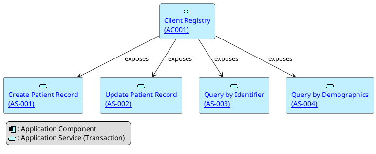

## Application Layer – Client Registry

This section exemplifies the **application-level architecture** of a **Client Registry (CR)**. 

The CR is modeled as an **Application Component**, and it **exposes** a set of distinct **Application Services** representing its supported workflows.

Each service represents a transaction or operation exposed by the CR to other systems such as EMRs or health information exchanges.

---

### Application Components

| ID     | Name            | Description                                                                 |
|--------|------------------|-----------------------------------------------------------------------------|
| AC001  | Client Registry  | Core application component responsible for patient identity management, exposing transactional services for demographic data creation, update, and retrieval. |

---

### Application Services

| ID      | Name                                 | Description                                                                 |
|---------|--------------------------------------|-----------------------------------------------------------------------------|
| CRWF-1  | Create Patient Record                | Service that supports the creation of a new patient demographic record in the CR. |
| CRWF-2  | Update Patient Record                | Service that supports updating an existing patient’s demographic data.      |
| CRWF-3  | Query by Identifier                  | Service that allows clients to retrieve a patient record by supplying a unique identifier. |
| CRWF-4  | Query by Demographics                | Service that enables clients to search for patient records using demographic criteria (e.g., name, birthdate, gender). |

Each of these services is **exposed by** the `Client Registry` and can be invoked by external systems through defined interfaces (e.g., RESTful APIs, HL7 v3 messages, IHE transactions). See technology layer for more details.

---

### 🔗 Relationships

- The `Client Registry` **exposes** each Application Service directly.
- Each service maps to a **functional transaction** described in the business layer, and can be traced back to the workflows described in the business process model (e.g., "Register New Client", "Update Client Demographics").

---

### Visual Representation (Summary)

Each application service is represented as <<service>> and is linked from the Client Registry application component (<<structure>>), as shown in the diagram.

> This structure supports traceability from **business processes** down to **application-level capabilities**, and ultimately to **data and technology layers** if needed.

